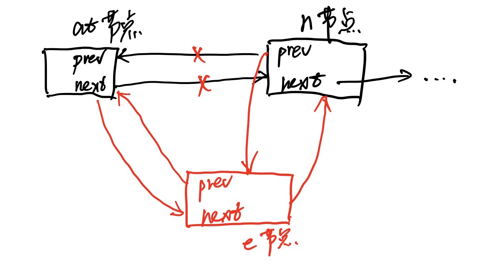
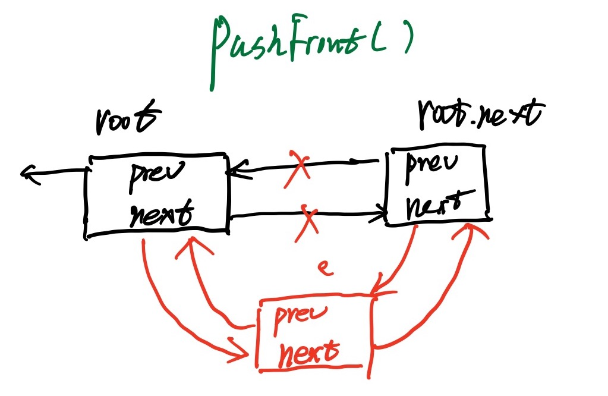
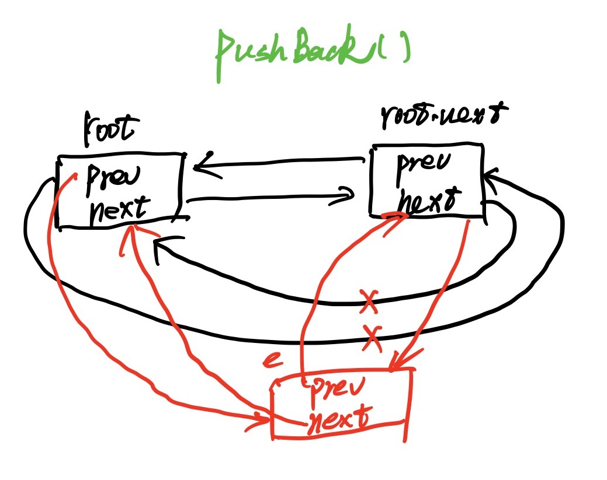
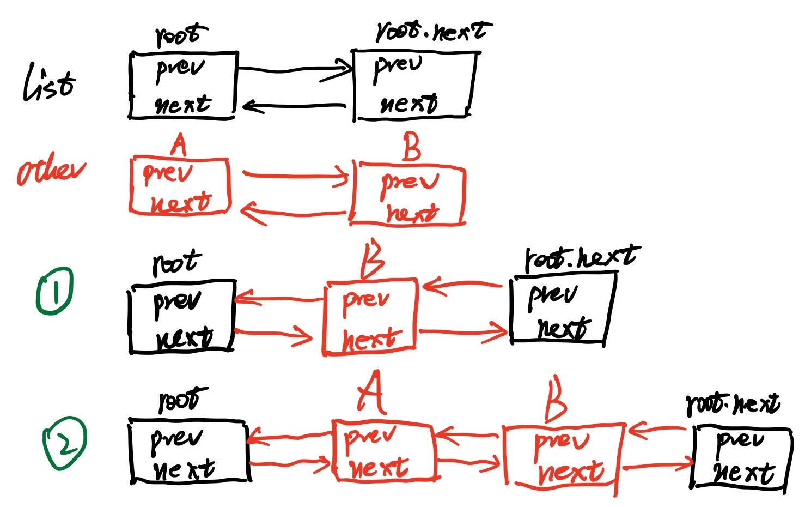
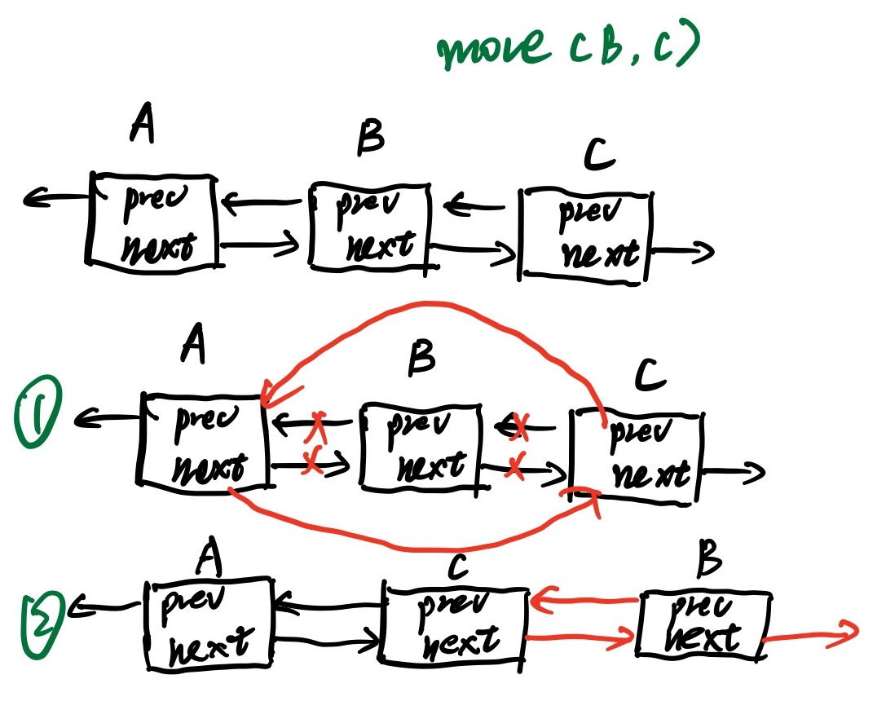
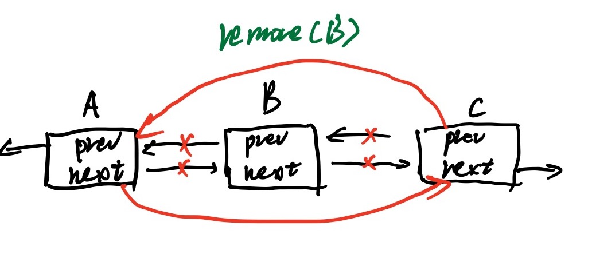

# list源码

[TOC]

## 数据结构

`list`源码中一共有2个`struct`，分别是

1. `Element`，实现双向链表和存储数据的结构体。源码如下：
```go
// Element is an element of a linked list.
type Element struct {
	// Next and previous pointers in the doubly-linked list of elements.
	// To simplify the implementation, internally a list l is implemented
	// as a ring, such that &l.root is both the next element of the last
	// list element (l.Back()) and the previous element of the first list
	// element (l.Front()).
	next, prev *Element

	// The list to which this element belongs.
	list *List

	// The value stored with this element.
	Value interface{}
}
```

2. `list`表示一个双向链表，持有`root`节点和链表长度两个字段，使用`root`节点实现了环形链表，第一个数据节点（用户插入的，这里用来区别`root element`）的`prev`指针指向`root`，最后一个数据节点的`next`指针指向`root`，形成了一个环状结构。源码如下：
```go
// List represents a doubly linked list.
// The zero value for List is an empty list ready to use.
type List struct {
	root Element // sentinel list element, only &root, root.prev, and root.next are used
	len  int     // current list length excluding (this) sentinel element
}
```


综上：go语言`list`实现使用的是双向循环链表，链表第一个节点`root.Next`，最后一个节点`root.Prev`。
## Element方法
`Element`中有两个方法，`Prev()`和`Next()`分别用来获取当前元素的前一个和后一个元素。
```go
// Next returns the next list element or nil.
func (e *Element) Next() *Element {
	if p := e.next; e.list != nil && p != &e.list.root {
		return p
	}
	return nil
}

// Prev returns the previous list element or nil.
func (e *Element) Prev() *Element {
	if p := e.prev; e.list != nil && p != &e.list.root {
		return p
	}
	return nil
}
```
## List方法
### 获取list长度
list长度使用`Len()`方法获取。
```go
// Len returns the number of elements of list l.
// The complexity is O(1).
func (l *List) Len() int { return l.len }
```
### 初始化
初始化一共有三个相关方法

- `Init()` ：初始化为环状结构。
```go
// Init initializes or clears list l.
func (l *List) Init() *List {
	l.root.next = &l.root
	l.root.prev = &l.root
	l.len = 0
	return l
}
```

- `New()`：返回初始化后的list。
```go
// New returns an initialized list.
func New() *List { return new(List).Init() }
```

- `lazyInit()`：延迟初始化，用于向list插入的场景。
```go
// lazyInit lazily initializes a zero List value.
func (l *List) lazyInit() {
	if l.root.next == nil {
		l.Init()
	}
}
```
### 插入元素
所有的以`Push`开头的方法，都需要执行`lazyInit`操作，来检查`list`是否被初始化，没有的初始化需要进行延迟初始化。
所有的插入操作（`Push`开头或者是`Insert`开头）都是使用InsertValue执行最终的插入。
#### 内部方法（首字母小写）
所有PUBLIC的插入操作都是通过以下两个方法内部进行插入：

1. `insert()`：`insert()`方法最后被调用，将元素`e`插入在`at`元素后面，然后将当前插入的元素`list`指针指向当前列表（`e.list = l`），增加list长度（`l.len++`）；
1. insertValue()：调用`insert`方法前，调用`insertValue()`方法，将`interface{}`类型的元素包装为`Element`（所以`list`可以包含任意类型的元素），然后调用`insert()`方法将包装好的`Element`插入`list`）。
```go
// insert inserts e after at, increments l.len, and returns e.
func (l *List) insert(e, at *Element) *Element {
	n := at.next
	at.next = e
	e.prev = at
	e.next = n
	n.prev = e
	e.list = l
	l.len++
	return e
}

// insertValue is a convenience wrapper for insert(&Element{Value: v}, at).
func (l *List) insertValue(v interface{}, at *Element) *Element {
	return l.insert(&Element{Value: v}, at)
}
```



#### 外部方法（首字母大写）

1. `PushFront()`：在`list`头部插入元素，即在`root`节点的后面插入。
```go
// PushFront inserts a new element e with value v at the front of list l and returns e.
func (l *List) PushFront(v interface{}) *Element {
	l.lazyInit()
	return l.insertValue(v, &l.root)
}
```
这里使用延迟初始化`lazyInit()`，让`list`在使用时才被初始化。然后调用`insertValue()`想`v`包装为`Element`然后插入到`root`后面。


2. `PushBack()`：在链表`l`尾部插入元素，即在`root`结点的前面插入元素（注：go语言实现的链表是一个双向循环列表）。
```go
// PushBack inserts a new element e with value v at the back of list l and returns e.
func (l *List) PushBack(v interface{}) *Element {
	l.lazyInit()
	return l.insertValue(v, l.root.prev)
}
```
首先执行延迟初始化，然后使用insertValue方法，将v包装为Element插入到root前一个结点的后面（相当于在root前面插入）。


3. `InsertBefore()`：在某个元素（`mark`）前插入指定值`v`的元素。
```go
// InsertBefore inserts a new element e with value v immediately before mark and returns e.
// If mark is not an element of l, the list is not modified.
// The mark must not be nil.
func (l *List) InsertBefore(v interface{}, mark *Element) *Element {
	if mark.list != l {
		return nil
	}
	// see comment in List.Remove about initialization of l
	return l.insertValue(v, mark.prev)
}
```

   - mark元素不能为nil，并且要属于当前list。
   - 然后调用insertValue()，将其插入到mark元素的前面，即mark元素前一个元素的后面。
4. `InsertAfter()`：在某个元素`mark`后插入指定值`v`的元素。
```go
// InsertAfter inserts a new element e with value v immediately after mark and returns e.
// If mark is not an element of l, the list is not modified.
// The mark must not be nil.
func (l *List) InsertAfter(v interface{}, mark *Element) *Element {
	if mark.list != l {
		return nil
	}
	// see comment in List.Remove about initialization of l
	return l.insertValue(v, mark)
}
```
mark元素不能为nil，并且要属于当前list。然后调用insertValue()，将其插入到mark元素的前面。

5. `PushBackList()`：在当前链表`l`尾部插入指定的链表`other`。
```go
// PushBackList inserts a copy of an other list at the back of list l.
// The lists l and other may be the same. They must not be nil.
func (l *List) PushBackList(other *List) {
	l.lazyInit()
	for i, e := other.Len(), other.Front(); i > 0; i, e = i-1, e.Next() {
		l.insertValue(e.Value, l.root.prev)
	}
}
```

   - 首先执行延迟初始化。
   - 然后从头依向后次（`e.Next`）遍历每一个`other`链表中的元素，每次遍历将其插入到链表尾部（即`root.Prev`的后面）。


6. `PushFrontList()`：在当前链表`l`的头部插入指定链表`other`。
```go
// PushFrontList inserts a copy of an other list at the front of list l.
// The lists l and other may be the same. They must not be nil.
func (l *List) PushFrontList(other *List) {
	l.lazyInit()
	for i, e := other.Len(), other.Back(); i > 0; i, e = i-1, e.Prev() {
		l.insertValue(e.Value, &l.root)
	}
}
```

   - 首先执行延迟初始化。
   - 然后从尾向前依次（`e.Prev`）遍历每一个other链表中的元素，每次遍历将其插入到链表头部（即`root`的后面）。


### 移动元素
所有的移动操作都使用内部方法`move()`方法进行移动。
#### 内部方法

1. `move()`将元素`e`移动至`at`之后。
```go
// move moves e to next to at and returns e.
func (l *List) move(e, at *Element) *Element {
	if e == at {
		return e
	}
	e.prev.next = e.next
	e.next.prev = e.prev

	n := at.next
	at.next = e
	e.prev = at
	e.next = n
	n.prev = e

	return e
}
```

#### 外部方法

1. `moveToFront()`：移动元素`e`到链表头部。
```go
// MoveToFront moves element e to the front of list l.
// If e is not an element of l, the list is not modified.
// The element must not be nil.
func (l *List) MoveToFront(e *Element) {
	if e.list != l || l.root.next == e {
		return
	}
	// see comment in List.Remove about initialization of l
	l.move(e, &l.root)
}
```

2. `MoveToBack()`：移动元素`e`到链表尾部。
```go
// MoveToBack moves element e to the back of list l.
// If e is not an element of l, the list is not modified.
// The element must not be nil.
func (l *List) MoveToBack(e *Element) {
	if e.list != l || l.root.prev == e {
		return
	}
	// see comment in List.Remove about initialization of l
	l.move(e, l.root.prev)
}
```

3. `MoveBefore()`：在`mark`元素前插入`e`元素。
```go
// MoveBefore moves element e to its new position before mark.
// If e or mark is not an element of l, or e == mark, the list is not modified.
// The element and mark must not be nil.
func (l *List) MoveBefore(e, mark *Element) {
	if e.list != l || e == mark || mark.list != l {
		return
	}
	l.move(e, mark.prev)
}
```

4. `MoveAfter()`：在`mark`元素后插入`e`元素。
```go
// MoveAfter moves element e to its new position after mark.
// If e or mark is not an element of l, or e == mark, the list is not modified.
// The element and mark must not be nil.
func (l *List) MoveAfter(e, mark *Element) {
	if e.list != l || e == mark || mark.list != l {
		return
	}
	l.move(e, mark)
}
```
### 删除元素
元素删除操作都使用内部方法`remove()`删除。
#### 内部方法

1. `remove()`：从`l`删除元素`e`，返回删除的元素。
```go
// remove removes e from its list, decrements l.len, and returns e.
func (l *List) remove(e *Element) *Element {
	e.prev.next = e.next
	e.next.prev = e.prev
	e.next = nil // avoid memory leaks
	e.prev = nil // avoid memory leaks
	e.list = nil
	l.len--
	return e
}
```
#### 
#### 外部方法

1. `Remove()`：从`list`删除元素`e`，返回删除的值。
```go
// Remove removes e from l if e is an element of list l.
// It returns the element value e.Value.
// The element must not be nil.
func (l *List) Remove(e *Element) interface{} {
	if e.list == l {
		// if e.list == l, l must have been initialized when e was inserted
		// in l or l == nil (e is a zero Element) and l.remove will crash
		l.remove(e)
	}
	return e.Value
}
```
如果被删除的元素`e`属于链表`l`，那么l肯定被初始化过，如果`l==nil`，则`l.remove`将会崩溃。
