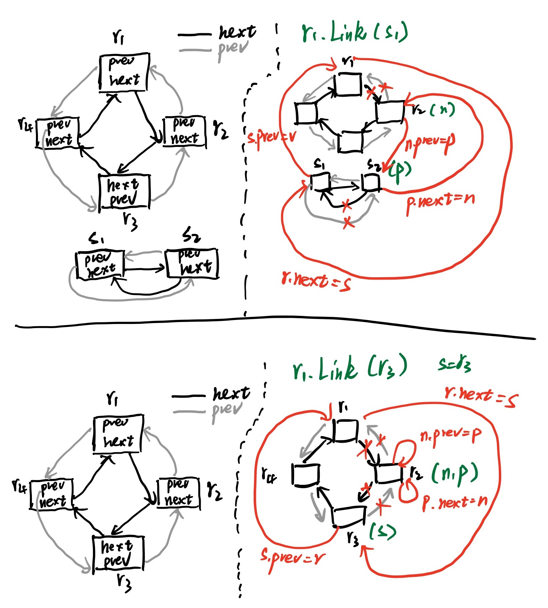

# ring

[TOC]

## 数据结构

`ring`是循环列表或某一个特定的元素。

- `ring`没有开始也没有结束。
- 指向任何`ring`元素的指针都可以作为对整个环的引用。
- `empty ring`用`nil`指针表示。
- `ring`的零值是一个值为`nil`的单元素环。

```go
// A Ring is an element of a circular list, or ring.
// Rings do not have a beginning or end; a pointer to any ring element
// serves as reference to the entire ring. Empty rings are represented
// as nil Ring pointers. The zero value for a Ring is a one-element
// ring with a nil Value.
//
type Ring struct {
    next, prev *Ring
    Value      interface{} // for use by client; untouched by this library
}
```

## 方法

### 新建和初始化

- `New()`方法将创建一个长度为`n`的`ring`。

- `init()`将`r`初始化为长度`1`的空`ring`，其值为`nil`。

```go
func (r *Ring) init() *Ring {
    r.next = r
    r.prev = r
    return r
}

// New creates a ring of n elements.
func New(n int) *Ring {
    if n <= 0 {
        return nil
    }
    r := new(Ring)
    p := r
    for i := 1; i < n; i++ {
        p.next = &Ring{prev: p}
        p = p.next
    }
    p.next = r
    r.prev = p
    return r
}
```

### 向前和向后遍历

```go
// Next returns the next ring element. r must not be empty.
func (r *Ring) Next() *Ring {
	if r.next == nil {
		return r.init()
	}
	return r.next
}

// Prev returns the previous ring element. r must not be empty.
func (r *Ring) Prev() *Ring {
	if r.next == nil {
		return r.init()
	}
	return r.prev
}
```

### 插入

`Link()`：连接环`r`和环`s`，环`r.Next()=s`，返回原来环`r`的下一个元素`r.Next()`。`r`不能为空。

- 如果s和r属于同一个`ring`，则删除s和r之间的元素，返回`s`（即`r.Next()`）。
- 如果s和r不属于同一个`ring`，则在r后面插入`s`，返回`r.Next()`。

```go
// Link connects ring r with ring s such that r.Next()
// becomes s and returns the original value for r.Next().
// r must not be empty.
//
// If r and s point to the same ring, linking
// them removes the elements between r and s from the ring.
// The removed elements form a subring and the result is a
// reference to that subring (if no elements were removed,
// the result is still the original value for r.Next(),
// and not nil).
//
// If r and s point to different rings, linking
// them creates a single ring with the elements of s inserted
// after r. The result points to the element following the
// last element of s after insertion.
//
func (r *Ring) Link(s *Ring) *Ring {
    n := r.Next()
    if s != nil {
        p := s.Prev()
        // Note: Cannot use multiple assignment because
        // evaluation order of LHS is not specified.
        r.next = s
        s.prev = r
        n.prev = p
        p.next = n
    }
    return n
}
```



### 移动ring元素

移动`ring`元素实际是将指向当前元素的指针向前或向后移动`n%r.Len(`)个元素，`ring`的结构不变。

```go
// Move moves n % r.Len() elements backward (n < 0) or forward (n >= 0)
// in the ring and returns that ring element. r must not be empty.
//
func (r *Ring) Move(n int) *Ring {
	if r.next == nil {
		return r.init()
	}
	switch {
	case n < 0:
		for ; n < 0; n++ {
			r = r.prev
		}
	case n > 0:
		for ; n > 0; n-- {
			r = r.next
		}
	}
	return r
}
```

### 删除ring元素

使用`Unlink`方法删除`n`个元素

- 如果`n<=0`，则返回`nil`，
- 如果`n>0`，则使用`Link`方法，从当前`ring`元素`Link`至后面第`n+1`个`ring`元素（`Link`当前`ring`的某个元素，实际上述删除两个元素之间的元素，参见上面插入元素）。

```go
// Unlink removes n % r.Len() elements from the ring r, starting
// at r.Next(). If n % r.Len() == 0, r remains unchanged.
// The result is the removed subring. r must not be empty.
//
func (r *Ring) Unlink(n int) *Ring {
   if n <= 0 {
      return nil
   }
   return r.Link(r.Move(n + 1))
}
```

### 获取长度

遍历整个`ring`，获取长度，复杂度为n。

```go
// Len computes the number of elements in ring r.
// It executes in time proportional to the number of elements.
//
func (r *Ring) Len() int {
   n := 0
   if r != nil {
      n = 1
      for p := r.Next(); p != r; p = p.next {
         n++
      }
   }
   return n
}
```

### 遍历并执行自定义操作

向前遍历整个`ring`，并且对每个`ring`元素执行`f`操作。

```go
// Do calls function f on each element of the ring, in forward order.
// The behavior of Do is undefined if f changes *r.
func (r *Ring) Do(f func(interface{})) {
	if r != nil {
		f(r.Value)
		for p := r.Next(); p != r; p = p.next {
			f(p.Value)
		}
	}
}
```


